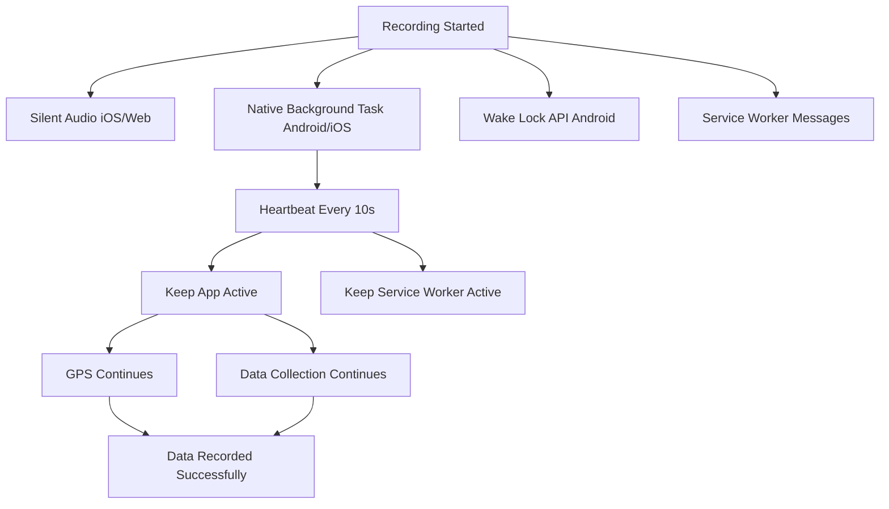

# Background Recording - Android Fix Documentation

## Problem
When the app is minimized or in background on Android, **no data is recorded** even though the app doesn't crash. The timer continues to run but data collection stops.

## Root Cause
Android aggressively suspends JavaScript execution when apps go to background to save battery. This causes:
- `setInterval`/`setTimeout` to be throttled or suspended
- GPS updates to stop
- Data collection in `GlobalDataCollector` to pause

## Solution Implemented

### 1. **Native Background Task** (`nativeBackgroundTask.ts`)
- Uses `@capawesome/capacitor-background-task` plugin (already configured in `capacitor.config.ts`)
- Starts a long-running background task when recording begins
- Implements a **heartbeat system** (every 10 seconds) to keep the app active
- Sends heartbeat messages to Service Worker to maintain both layers active

### 2. **Integration with Recording Service** 
Updated `recordingService.ts` to:
- Start native background task on `startRecording()`
- Stop native background task on `stopRecording()`
- Works in parallel with existing silent audio keep-alive (for web/hybrid mode)

### 3. **Enhanced Hook** (`useNativeBackgroundMode.ts`)
- Added proper heartbeat implementation in `BackgroundTask.beforeExit()`
- Heartbeat logs every 10 seconds to prove the app is still alive
- Sends heartbeat to Service Worker to keep it active

### 4. **Multi-Layer Keep-Alive Strategy**



## Testing Instructions

### On Android Device:
1. **Start Recording** from the app
2. **Minimize the app** or press Home button
3. **Check logs** for:
   ```
   🚀 Starting native background task...
   🔄 App entering background - activating background task...
   💓 Background heartbeat #1
   💓 Background heartbeat #2
   ...
   ```
4. **Wait 2-3 minutes** while app is in background
5. **Return to app** and stop recording
6. **Verify data** - should have continuous data points during background period

### On Web/PWA:
1. System falls back to silent audio + Wake Lock
2. Same testing procedure applies
3. Less reliable than native mode but should work

## Key Configuration

### Capacitor Config (`capacitor.config.ts`)
```typescript
ios: {
  backgroundModes: ['bluetooth-central', 'location', 'audio'],
},
android: {
  allowMixedContent: true,
},
plugins: {
  BackgroundTask: {
    android: {
      notificationTitle: 'PMScan Recording',
      notificationText: 'Recording air quality data in background',
      notificationIcon: 'ic_notification',
      notificationColor: '#4F46E5',
    },
  },
}
```

### GPS Background Updates
GPS is already configured for background in:
- `useGPS.ts` - high accuracy mode enabled
- `capacitor.config.ts` - location background mode enabled
- GPS should continue updating even in background

## Logs to Monitor

### Success Indicators:
```
✅ Recording started! Final isRecording state: true
🚀 Starting native background task...
✅ Native background task started successfully
🔄 App entering background - activating background task...
💓 Background heartbeat #1
💓 Background heartbeat #2
[Data collection logs from GlobalDataCollector]
```

### Failure Indicators:
```
⚠️ Native background mode not supported, using PWA fallback
⚠️ BackgroundTask plugin not available
❌ Failed to start native background task
```

## Expected Behavior

### Before Fix:
- ❌ App goes to background → data recording stops
- ❌ Timer continues but no data points added
- ❌ Gaps in recorded data during background periods

### After Fix:
- ✅ App goes to background → background task activated
- ✅ Heartbeat keeps app alive (visible in logs every 10s)
- ✅ GPS continues to update location
- ✅ Data collection continues normally
- ✅ Continuous data points throughout recording session

## Platform Support

| Platform | Background Recording | Method |
|----------|---------------------|---------|
| **Android Native** | ✅ Full support | Background Task + Heartbeat |
| **iOS Native** | ✅ Full support | Background Task + Silent Audio |
| **PWA/Web Android** | ⚠️ Limited | Silent Audio + Wake Lock |
| **PWA/Web iOS** | ⚠️ Limited | Silent Audio only |

## Deployment Steps

1. **Pull latest code** from repository
2. **Run `npx cap sync`** to sync native platforms
3. **Build app**: `npm run build`
4. **Test on Android device**: `npx cap run android`
5. **Verify logs** show heartbeat when app is in background

## Future Enhancements

- [ ] Add visual indicator showing background recording is active
- [ ] Show notification while recording in background (Android)
- [ ] Add battery usage optimization settings
- [ ] Implement adaptive heartbeat frequency based on battery level
- [ ] Add statistics dashboard showing background recording reliability

## Related Files

- `src/lib/nativeBackgroundTask.ts` - New background task manager
- `src/services/recordingService.ts` - Integration with recording
- `src/hooks/useNativeBackgroundMode.ts` - React hook wrapper
- `src/lib/backgroundKeepAlive.ts` - Silent audio keep-alive
- `src/components/GlobalDataCollector.tsx` - Data collection
- `capacitor.config.ts` - Native configuration

## Support

If background recording still doesn't work:
1. Check device battery optimization settings
2. Ensure app has location permissions (Always/Background)
3. Verify BackgroundTask plugin is installed: `npx cap ls`
4. Check Android notification settings (foreground service notification must show)
5. Review console logs for error messages
