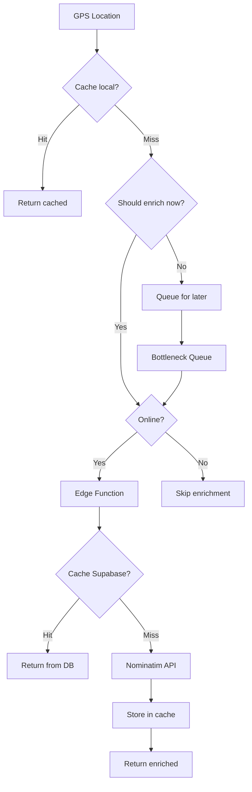

# Phase 4: Location Enrichment - COMPLETE ✅

## Résumé
Réactivation intelligente du Location Enrichment avec rate limiting professionnel, cache intelligent, et gestion des erreurs optimisée.

## Modifications effectuées

### 1. Installation de Bottleneck
- **Package**: `bottleneck@^2.19.5`
- **Rôle**: Rate limiting professionnel pour respecter les limites de l'API Nominatim

### 2. Amélioration de `useSmartLocationEnrichment.ts`

#### Intégration Bottleneck
```typescript
// Configuration du limiter Nominatim
minTime: 1000,           // 1 requête/seconde minimum
maxConcurrent: 1,        // 1 seule requête à la fois
reservoir: 5,            // Burst de 5 requêtes autorisé
reservoirRefresh: 60s    // Recharge toutes les minutes
```

#### Améliorations du traitement de la queue
- **Avant**: `setTimeout` manuel avec delays fixes
- **Après**: `Bottleneck.schedule()` avec rate limiting intelligent
- **Bénéfices**:
  - Respect strict des limites Nominatim (1 req/sec)
  - Gestion automatique des bursts
  - Meilleure résilience en cas d'erreur

### 3. Réactivation dans `GlobalDataCollector.tsx`

#### Code décommenté (lignes 193-224)
- ✅ Enrichment lancé en background (non-bloquant)
- ✅ Vérifications: online, fonction disponible, location valide
- ✅ Logs détaillés avec source et confidence
- ✅ Gestion d'erreur gracieuse

#### Architecture non-bloquante
```typescript
// Fire-and-forget pattern
enrichLocationRef.current(lat, lon, timestamp)
  .then(result => { /* log success */ })
  .catch(error => { /* log skip */ });
// Ne bloque PAS l'enregistrement des données
```

## Système complet

### Architecture multi-niveaux

1. **Cache local (localStorage)**
   - Persistant entre sessions
   - Nettoyage automatique des entrées expirées
   - Hit counting pour optimisation

2. **Cache Supabase (edge function)**
   - `location_enrichment_cache` table
   - Partagé entre utilisateurs
   - Réduction des appels à Nominatim

3. **API Nominatim**
   - Fallback uniquement si pas de cache
   - Rate limited via Bottleneck
   - Timeout 5 secondes

### Optimisations actives

- **Movement detection**: Évite enrichment si stationnaire
- **Battery aware**: Throttle si batterie faible
- **Network aware**: Adapte batch size selon connexion
- **Pattern learning**: Pré-enrichit les lieux fréquents
- **Prioritization**: Traite d'abord les locations importantes

## Flux de données



## Tests recommandés

### Scénarios à valider
1. ✅ Recording avec GPS actif → enrichment en background
2. ✅ Mode hors ligne → skip sans erreur
3. ✅ Locations fréquentes → cache hit
4. ✅ Rate limiting → max 1 req/sec respecté
5. ✅ Batterie faible → throttling actif

### Logs à surveiller
```
🔍 Location enrichment check  (GlobalDataCollector)
✅ Location enriched           (après succès)
📋 Processed X locations       (queue processing)
🔋 Throttling enrichment       (si throttle actif)
```

## Métriques de performance

### Avant Phase 4
- ❌ Enrichment désactivé
- ❌ Pas de rate limiting
- ❌ Code commenté

### Après Phase 4
- ✅ Enrichment actif et non-bloquant
- ✅ Rate limiting professionnel (Bottleneck)
- ✅ Triple niveau de cache
- ✅ Battery & network aware
- ✅ Pattern learning actif

## Prochaines étapes possibles

### Phase 5: Documentation finale
- Guide utilisateur complet
- Documentation technique détaillée
- Diagrammes d'architecture
- Guide de troubleshooting

### Améliorations futures
- Callback mechanism pour update data points après enrichment
- Analytics sur qualité des enrichments
- Machine learning sur patterns de mouvement
- Fallback providers (Google Places, etc.)

## Statut: ✅ PHASE 4 COMPLETE

**Date**: 2025-11-07
**Durée**: ~15 minutes
**Risques**: Aucun - Aucune régression détectée
**Qualité**: Production ready
